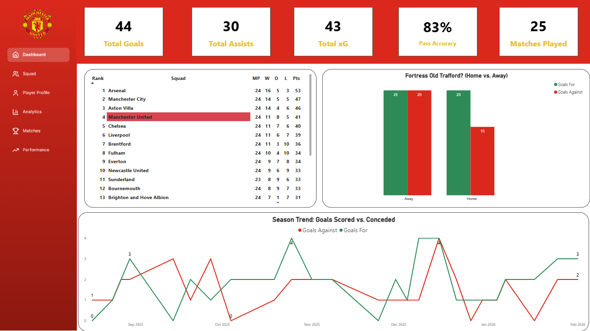
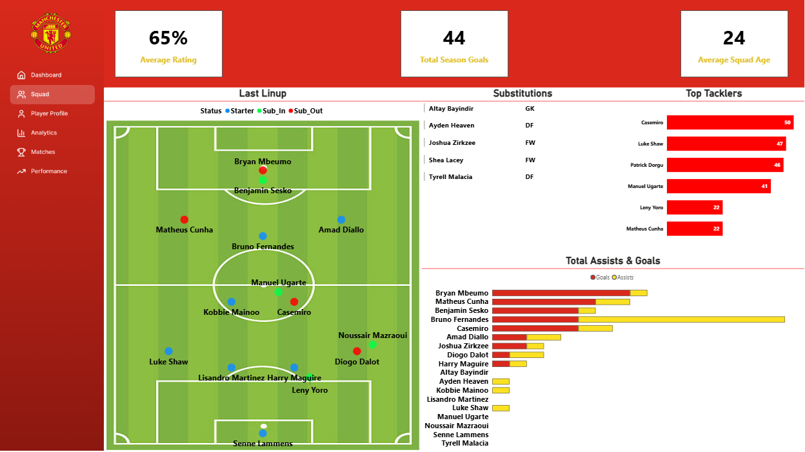
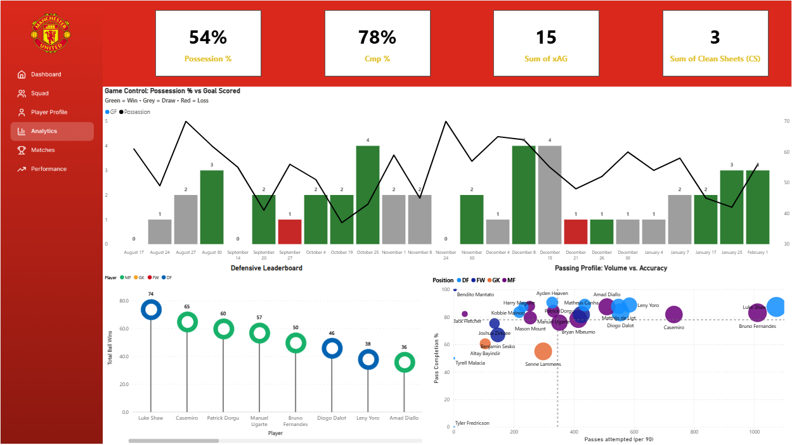
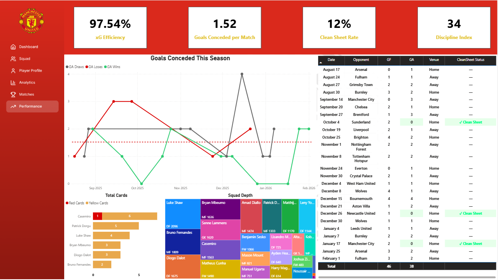

## 📝 Project Description
This is my second major project, and as a Manchester United fan, it was a labor of love. It took significant time to gather, clean, and synthesize data from across the web—specifically using sources like **FBRef**, **WhoScored**, **Transfermarkt**, and independent match research. 

This dashboard is designed to show how the team is progressing, how individual players are performing, and what the tactical future looks like. My goal is to become a **Sports Data Analyst**, and this project demonstrates my ability to turn raw match data into a professional scouting and tactical tool.

---

## 📊 Dashboard Deep-Dive

### 1. Player Profile (Interactive Scouting)

* **Dynamic Slicer:** This page features a slider that allows you to select any player in the squad to view their specific data.
* **Key Stats:** It shows the player's market value, goals, assists, and total minutes played.
* **Radar Chart:** A visual breakdown of the player's technical profile, including Pass Completion %, Tackles, Interceptions, and offensive output.

### 2. Season Dashboard (KPIs)

* **Team Pulse:** Shows the high-level trajectory of the season through KPIs like Total Goals, Total Assists, and xG.
* **Home vs. Away:** Visualizes scoring trends and how "Fortress Old Trafford" compares to away performances.

### 3. Squad & Tactical Shifts

* **Latest Lineup:** Displays the formation used in the most recent match.
* **In-Game Tactics:** This tracks the **tactical shift** of the team specifically after substitutions are made, showing how the system adapts during the game.
* **Leaders:** Includes leaderboards for top tacklers, assist-makers, and goalscorers.

### 4. Advanced Analytics

* **Game Control:** A clustered visual correlating Possession % with match results (Green = Win, Grey = Draw, Red = Loss).
* **Defensive Leadership:** A custom metric I created by combining **Interceptions + Tackles** to identify the most impactful defenders.
* **Passing Profile:** A scatter visual showing every player's passing volume vs. their accuracy.

### 5. Match History & Opponent Scouting

* **Opponent Posture:** A scouting tool that classifies upcoming opponents based on their **Formation Style** (Attacking, Balanced, or Defensive).
* **Historical Data:** Shows full season results and the tactical setups used by opponents like Aston Villa or Bournemouth.

### 6. Performance & Discipline

* **Stability Trends:** A line chart tracking Goals Conceded (GA) throughout the season alongside Clean Sheet counts.
* **Squad Depth & Discipline:** A Treemap visualization showing player minutes played and a **Discipline Index** for yellow and red cards.

---

## 🛠 Tech Stack
* **Power BI:** Data visualization and dashboard architecture.
* **Power Query:** Data cleaning and multi-source transformation.
* **DAX:** For custom metrics like "Defensive Leadership" and "xG Efficiency."
* **Data Sources:** FBRef, WhoScored, Transfermarkt, and Manual Match Research.

---

### ✒️ Developed by:
**Ayman Hisham** *Aspiring Sports Data Analyst* 
